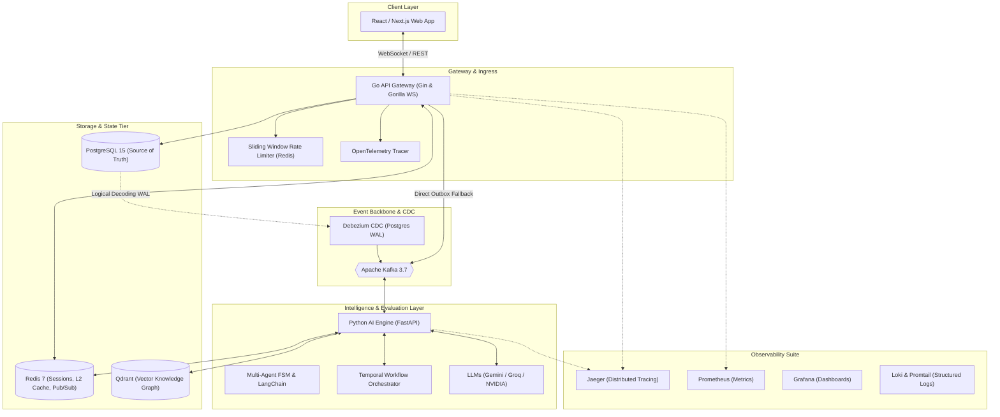

# Archon 🏛️
### AI-Native Distributed System Design Interview & Evaluation Platform

[](https://golang.org)
[](https://python.org)
[](https://www.postgresql.org)
[](https://redis.io)
[](https://kafka.apache.org)
[](https://qdrant.tech)
[](https://temporal.io)
[](https://opentelemetry.io)

---

## 📌 Overview

**Archon** is a production-grade, AI-native SaaS platform designed to conduct, evaluate, and score Senior and Staff-level **System Design Interviews**. 

Combining the real-time collaboration of interactive whiteboards, the conversational realism of veteran tech leads, and the analytical power of multi-model LLMs (Google Gemini, Groq LLaMA-3.3, NVIDIA Vision), Archon provides objective, multi-dimensional feedback across Requirements Gathering, Capacity Estimation, API/Data Modeling, High-Level Architecture, and Failure Mode Analysis.

---

## 🏛️ System Architecture

Archon is architected as an **Event-Driven, CQRS Polyglot Distributed System** built with **Go** (for ultra-low latency I/O, WebSockets, rate limiting, and business services) and **Python** (for asynchronous LLM orchestration, vector retrieval, and background scoring).



---

## ⚙️ The 6 Core Engines

Archon is structured around Domain-Driven Design (DDD) bounded contexts:

1. **Interview Generation Engine (`internal/interview`)**:
   Dynamically generates role-, difficulty-, and company-tailored system design scenarios with evaluation rubrics and time constraints.
2. **Conversation & Multi-Agent Engine (`ai_engine/app/services`)**:
   Maintains a stateful Finite State Machine (`REQUIREMENTS` $\to$ `ESTIMATION` $\to$ `HIGH_LEVEL` $\to$ `DEEP_DIVE` $\to$ `COMPLETED`) to prevent conversational drift and simulate realistic senior interviewer prompts.
3. **Diagram Engine (`internal/diagram`)**:
   Streams structured JSON architectural graphs (`nodes` and `edges`) in real-time over WebSockets, allowing the AI to analyze whiteboard state without blocking candidate interactions.
4. **Evaluation Engine (`internal/reports`)**:
   Scores candidates across 5 core dimensions (Requirements, Estimation, API Design, Data Modeling, Scalability/Reliability) using multi-tier evaluation prompts.
5. **Knowledge Engine & RAG (`ai_engine/app/services/knowledge_service.py`)**:
   Grounds interview evaluations with factual engineering architectures using **Qdrant** vector search and local sentence-transformer embeddings (`sentence-transformers/all-MiniLM-L6-v2`).
6. **Reporting & Feedback Engine (`internal/reports`)**:
   Synthesizes comprehensive JSON scorecards with actionable recommendations, anti-pattern breakdowns, and customized study paths.

---

## 🚀 Key Distributed Systems Highlights

* **Transactional Outbox & Debezium CDC**:
  Guarantees atomic state persistence in PostgreSQL and event streaming to Kafka via PostgreSQL Write-Ahead Log (`WAL`) logical decoding, completely eliminating the Dual-Write Problem.
* **Distributed WebSockets with Redis Pub/Sub**:
  Scales stateful WebSocket connections horizontally across multiple Go API replicas with thread-safe `sync.Mutex` write pumps, heartbeat ping/pong lifecycle management, and connection leak prevention.
* **Sliding Window Log Rate Limiting**:
  Atomic Redis sliding window rate limiter implemented via Lua scripts to protect downstream LLM gateways from token starvation and DDoS attacks.
* **Resilience & Circuit Breakers**:
  Configurable circuit breakers (`pkg/resilience`) and retry policies to isolate external third-party LLM provider downtime.
* **Two-Tier Cache Architecture**:
  L1 In-Memory sync cache combined with L2 Distributed Redis caching and Pub/Sub invalidation channels for sub-microsecond hot reads.
* **Distributed Tracing & Full-Stack Telemetry**:
  End-to-end W3C trace context propagation across HTTP $\to$ WebSockets $\to$ Kafka $\to$ Python AI Engine visualized in **Jaeger**, **Prometheus**, **Grafana**, and **Loki**.
* **Supply Chain Security & Dependabot**:
  Automated multi-ecosystem vulnerability scans across Go modules, Python dependencies, Docker multi-stage images, and GitHub Actions.

---

## 🛠️ Technology Stack

| Layer | Technologies |
|---|---|
| **Backend API Gateway** | Go 1.22, Gin, Gorilla WebSocket, pgx/v5, go-redis, kafka-go |
| **AI & LLM Services** | Python 3.11, FastAPI, LangChain, Qdrant Client, FastEmbed, Temporal SDK |
| **Databases & Cache** | PostgreSQL 15 (WAL Logical Decoding), Redis 7 Alpine, Qdrant Vector DB |
| **Event Streaming** | Apache Kafka 3.7 (KRaft mode), Debezium Connect 2.6 |
| **Workflow Orchestrator** | Temporal 1.23 |
| **Observability** | OpenTelemetry Go/Python SDKs, Jaeger 1.57, Prometheus, Grafana, Loki |
| **Infrastructure** | Docker, Docker Compose, Multi-Stage Builds |

---

## 📁 Repository Structure

```text
├── .agents/                    # Architecture vision & System Design Interview notes
├── .github/                    # Dependabot & GitHub Actions workflows
├── ai_engine/                  # Python FastAPI AI & LLM Evaluation Service
│   ├── app/
│   │   ├── core/               # Configuration, Key Rotators, OpenTelemetry
│   │   ├── services/           # LLM, Kafka, Knowledge RAG, Temporal Workflows
│   │   └── main.py             # FastAPI entrypoint
│   ├── Dockerfile
│   └── requirements.txt
├── cmd/
│   └── api/                    # Go API Gateway Main Entrypoint
├── debezium/                   # CDC connector configs and registration scripts
├── docs/                       # Swagger / OpenAPI 2.0 specifications
├── grafana/                    # Provisioned datasources and dashboard JSONs
├── internal/                   # Core DDD Bounded Contexts
│   ├── ai/                     # WebSocket Hub, Session Processors, Kafka Dispatchers
│   ├── analytics/              # User performance analytics and metrics
│   ├── auth/                   # JWT authentication, session tokens, user repos
│   ├── cache/                  # Redis connection management
│   ├── database/               # PostgreSQL connection pooling and migrations
│   ├── diagram/                # Real-time whiteboard graph ingestion & persistence
│   ├── interview/              # Interview lifecycle, Outbox workers, sessions
│   ├── quiz/                   # System design quiz bank & cached repositories
│   ├── reports/                # Report generation, scoring models, feedback
│   ├── server/                 # Gin HTTP/WS routing & middleware setup
│   └── settings/               # User configuration & preferences
├── pkg/                        # Reusable Infrastructure Packages
│   ├── config/                 # Environment loaders and typed configurations
│   ├── middleware/             # OpenTelemetry tracing, auth, Prometheus metrics
│   ├── ratelimit/              # Sliding window Redis rate limiters
│   ├── resilience/             # Generic circuit breakers and fallbacks
│   └── telemetry/              # OpenTelemetry Tracer Provider initializers
├── prometheus/                 # Prometheus scrape configurations
├── docker-compose.yml          # Full multi-container development environment
├── Dockerfile                  # Production multi-stage Go build
└── go.mod                      # Go dependencies and module definition
```

---

## ⚡ Quick Start

### 1. Prerequisites
* [Docker](https://docs.docker.com/get-docker/) (v24.0+) & [Docker Compose](https://docs.docker.com/compose/) (v2.20+)
* [Go](https://golang.org/dl/) (v1.22+) *(for local development)*
* [Python](https://www.python.org/downloads/) (v3.11+) *(for local AI engine development)*
* API Key for Google Gemini, Groq, or NVIDIA NIM

### 2. Environment Setup
Clone the repository and copy the environment template:
```bash
git clone https://github.com/MonuChaudhary14/Archon.git
cd Archon
cp .env.example .env # or configure your .env
```

Ensure your `.env` contains at least one active LLM API key:
```env
LLM_PROVIDER=gemini
GEMINI_API_KEY=your_gemini_api_key_here
# Or:
# LLM_PROVIDER=groq
# GROQ_API_KEY=your_groq_api_key_here
```

### 3. Launch with Docker Compose
Start the entire polyglot microservice cluster with a single command:
```bash
docker compose up --build -d
```

### 4. Service Port Mappings

| Service | Port | Description |
|---|---|---|
| **Go API Gateway** | `http://localhost:8080` | REST API, WebSocket Endpoint, Metrics |
| **Python AI Engine** | `http://localhost:8122` | FastAPI Documentation & AI Service |
| **Swagger UI** | `http://localhost:8080/swagger/index.html` | Interactive REST API Documentation |
| **Kafka UI** | `http://localhost:8085` | Topic inspector & consumer lag monitor |
| **Temporal UI** | `http://localhost:8233` | Background workflow visualization |
| **Jaeger UI** | `http://localhost:16686` | Distributed trace explorer |
| **Grafana** | `http://localhost:3000` | Real-time system dashboards (`admin/admin`) |
| **Prometheus** | `http://localhost:9090` | Time-series metric query engine |
| **Qdrant Vector DB** | `http://localhost:6333/dashboard` | Vector storage & embeddings console |

---

## 🧪 Testing

### Running Go Unit & Integration Tests
```bash
go test -v -race ./...
```

### Running Python AI Engine Tests
```bash
cd ai_engine
pytest tests/ -v
```
